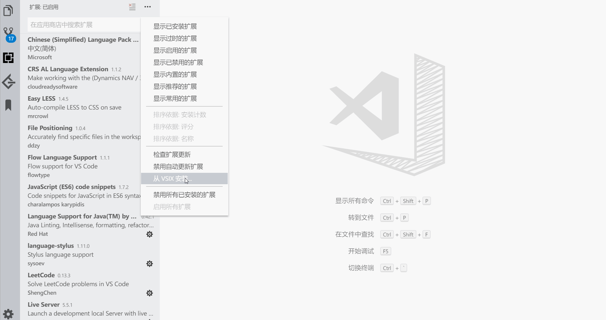

# Brackets Light Pro --improve

## Origin

使用原版请戳[这里](https://github.com/EryouHao/brackets-light-pro)

## Desc

魔改版`brackets-light-pro`, 主要是对`侧边栏的颜色`做了改进, 参考([issue#3](https://github.com/EryouHao/brackets-light-pro/issues/3))

## Usage

1. [Releases](https://github.com/ddzy/brackets-light-pro/releases)页下载插件
2. 解压后得到`.vsix`
3. VS Code中按如下使用
   

**Enjoy!**
